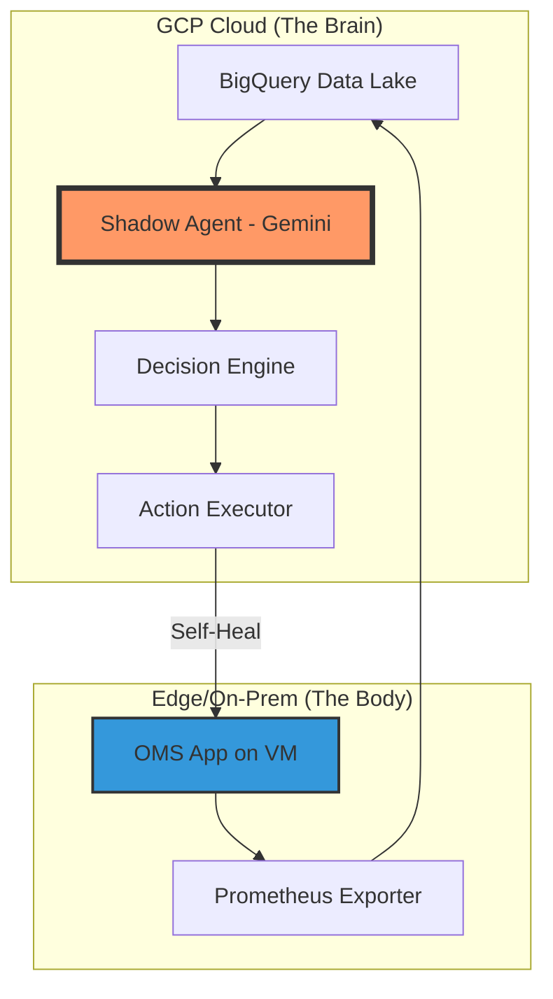

# 🛸 OMS Sentinel: The Self-Healing Neural Nexus

> "The human brain has 100 billion neurons, each a tiny processor in a vast, self-healing network. AI isn't just code; it's our attempt to externalize this biological genius to protect our digital infrastructure."

**OMS Sentinel** is a professional-grade, agentic AI pipeline designed to monitor, diagnose, and self-heal Order Management Systems (OMS) using Google Cloud Platform (GCP).

## 🧠 The Biological Inspiration
Just as the human nervous system detects pain and triggers an immediate reflex to protect the body, **OMS Sentinel** uses a Multi-Agent system to:
- **Sense**: Real-time telemetry via Prometheus & BigQuery.
- **Reason**: Gemini 1.5 Flash (The Cognitive Layer) analyzes anomalies like a brain identifies a virus.
- **Act**: The Decision Engine triggers healing actions (The Reflex Layer) to maintain equilibrium.

## 🏗️ System Architecture

## 🚀 Key Features
- **VAE Anomaly Detection**: Neural networks that detect "silent" system pain.
- **Diffusion Failure Prediction**: Estimating the time-to-failure before it happens.
- **Real-time Web Dashboard**: A stunning UI powered by Streamlit.
- **Hybrid Cloud Bridge**: Secure communication between Edge and Cloud.

## 🛠️ Setup
1. Clone the repo: `git clone ...`
2. Install deps: `pip install streamlit vertexai google-cloud-bigquery`
3. Authenticate: `gcloud auth application-default login`
4. Launch: `python main.py` and `streamlit run dashboard.py`

---
*Elevating OMS Resilience with Cloud-Native Intelligence.*
